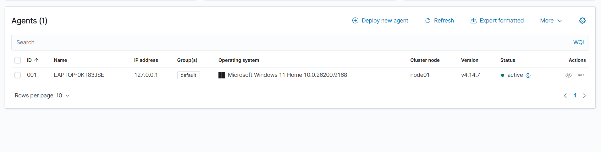
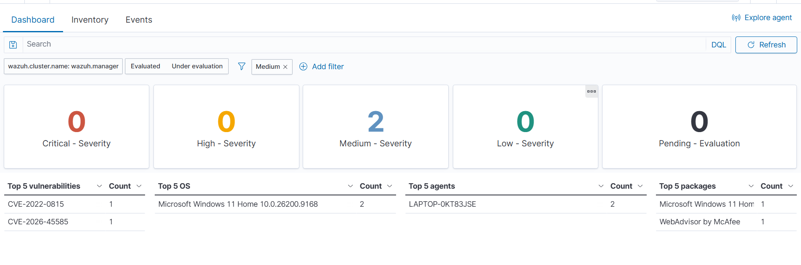
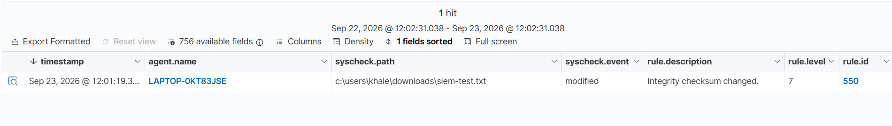

# Wazuh SIEM Home Lab

A hands-on cybersecurity lab focused on Security Information and Event Management (SIEM), Windows endpoint monitoring, security alert analysis, and File Integrity Monitoring (FIM) using Wazuh.

**Project Objective**

The objective of this project is to build a practical SIEM environment and gain hands-on experience with:

* **SIEM monitoring**
* Windows endpoint monitoring
* Security event collection
* Security alert analysis
* File Integrity Monitoring (FIM)
* Basic SOC operations
* Docker-based security infrastructure

 Lab Environment

| Component        | Technology         |
| ---------------- | ------------------ |
| Operating System | Windows 11         |
| SIEM Platform    | Wazuh 4.14.7       |
| Deployment       | Docker             |
| Manager          | Wazuh Manager      |
| Indexer          | Wazuh Indexer      |
| Dashboard        | Wazuh Dashboard    |
| Endpoint         | Windows 11         |
| Agent            | Wazuh Agent 4.14.7 |

## Lab Architecture

```text
Windows 11 Endpoint
        │
        │ Wazuh Agent
        ▼
  Wazuh Manager
        │
        ├── Wazuh Indexer
        │
        └── Wazuh Dashboard
                 │
                 ▼
          Security Alerts
```

## Implementation

### 1. Wazuh Deployment

Deployed Wazuh using the Docker-based single-node environment.

The lab includes:

* Wazuh Manager
* Wazuh Indexer
* Wazuh Dashboard

### 2. Wazuh Dashboard

Configured and accessed the Wazuh Dashboard through HTTPS and verified that the Wazuh services were operational.

### 3. Windows Endpoint Integration

Installed and configured the Wazuh Agent on a Windows 11 endpoint.

The endpoint was successfully registered with Wazuh and appeared as an active agent in the dashboard.

### 4. File Integrity Monitoring

Configured File Integrity Monitoring to monitor selected Windows directories, including:

* Windows Startup directory
* Downloads directory

FIM was used to detect changes to monitored files.

### 5. Security Alert Testing

Performed controlled file changes to generate Wazuh security events.

Example detected event:

```text
Integrity checksum changed
```

The alert was reviewed through the Wazuh Dashboard to understand how endpoint activity is collected, analyzed, and presented as a security event.

## Security Monitoring

This project demonstrates:

* Endpoint visibility
* File change detection
* Security event collection
* Alert investigation
* Basic event analysis

## Practical Skills

* Wazuh SIEM
* Security monitoring
* Windows endpoint security
* File Integrity Monitoring
* Log and alert analysis
* Docker
* Basic SOC workflows
* Security event investigation

## Project Evidence
### Wazuh Agent - Active



Windows 11 endpoint successfully connected to Wazuh and shown as **Active**.

### Vulnerability Detection



Wazuh detected **1 Medium-severity vulnerability** on the Windows 11 endpoint.

* **CVE:** CVE-2022-0815
* **Severity:** Medium
* **Affected OS:** Windows 11 Home 10.0.26200.9168
* **Affected Agent:** LAPTOP-0KT83JSE

### File Integrity Monitoring



Wazuh detected a modification to a monitored file with the alert **"Integrity checksum changed"** (Rule Level 7).


## Future Improvements

* Additional Windows event monitoring
* Custom detection rules
* More FIM test cases
* Authentication event monitoring
* Log analysis scenarios
* SOC investigation exercises
* Integration with additional security tools

## Author

**Khaled Al-Khozaei**

Cybersecurity | SOC | SIEM | Security Monitoring
